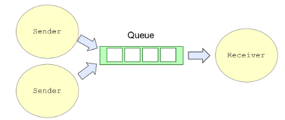

##Basics of concurrency
### Threads

- The Thread class encapsulates the idea of a schedulable entity within the runtime system.
- The Runnable interface defines one method, called run(), and this method encapsulates the work that the thread should perform when its execution is started.
- Each thread is associated with a runnable object (many to one relationship)

###Thread Lifecycle 

### Thread termination 
- If the global System.exit() method is called, this has the effect of immediately terminating all threads.
- It is possible to synchronize with the termination of a thread, by calling its join() method. This will block the calling thread until the target thread terminates
- Application terminates when the last non-daemon threads terminate.

### Executor 
- provides a way of defining the execution context for a given task in an abstract and flexible way.
- devolves the decision of how to execute a task to its implementation.
- Some mechanisms out of the box :

  
### Executor lifecycle 
- managed by executorService 

  
### Returning a value
#### Callable and Future
- Callable<T>, which allows us to define a task that returns a value of type T.
- submit() method on executor service takes Callable<> as an argument and returns Future.
-  Future is a placeholder that will contain the result of an expression or task that is being executed asynchronously.

#### CompletableFuture
- concrete implementation of Future.
- https://www.baeldung.com/java-completablefuture#:~:text=Java%208%20introduced%20the%20CompletableFuture%20class.&text=CompletableFuture%20is%20at%20the%20same,computation%20steps%20and%20handling%20errors.

###Blocking queue

- https://www.baeldung.com/java-blocking-queue